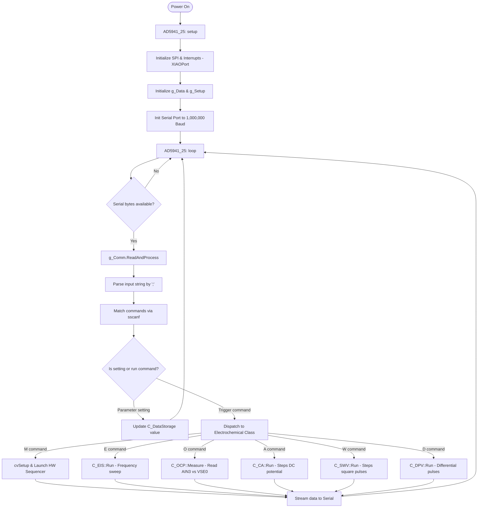

# Architecture Document: HunStat2 (AD5941_25 Firmware)

This document provides a comprehensive overview of the design, module structure, control flow, command-parsing protocol, and hardware details of the HunStat2 firmware (`AD5941_25`).

---

## 1. System Overview

**HunStat2** is a modular firmware written in C/C++ (Arduino framework) designed to run on a microcontroller (e.g., Seeed Studio XIAO RP2040) interfaced with the **Analog Devices AD5940/AD5941** electrochemical analog front-end (AFE) chip. 

The firmware allows performing several electrochemical techniques and streaming the measurement results back to a host computer (like a Python UI or LabVIEW test interface) over a high-speed Serial port (default baudrate: 1,000,000).

```
   +------------------+                    +-----------------------+
   |                  |    Serial Comm     |  Microcontroller      |
   |     Host PC      |<==================>|  (Seeed XIAO RP2040)  |
   | (Python UI / LVs)|  (e.g. 1M Baud)    |                       |
   +------------------+                    +-----------+-----------+
                                                       |
                                                       | SPI / Pins
                                                       v
                                           +-----------------------+
                                           |      AD5940/AD5941    |
                                           |      Potentiostat     |
                                           +-----------------------+
```

---

## 2. Directory and File Structure

The project has been refactored from a monolithic codebase into a modular, object-oriented design:

```
AD5941_25/
│
├── AD5941_25.ino           # Main Arduino entry point (orchestrates setup & loop)
├── cv.cpp                  # Cyclic Voltammetry (CV) runner wrapper
├── rampTest.cpp            # Hardware sequencer driver for CV (sweeps LPDAC & samples ADC)
├── XIAOPort.cpp            # Hardware abstraction layer (SPI and GPIO pin definitions)
├── utilities.cpp           # General helper functions (math, history, LEDs, NeoPixel)
├── debug.h                 # Instrumentation for tracing execution durations/variables
│
└── src/                    # Refactored Modular Components
    ├── ad5940/             # Analog Devices official low-level driver library
    ├── setup/              # Calibration and chip startup sequences
    ├── data_storage/       # Storage of calibration constants and parameter values
    ├── communication/      # Command parser, serial input processing, and method dispatching
    ├── interface/          # LED status interfaces
    └── electrochemical_methods/
        ├── c_ocp.cpp       # Open Circuit Potential (OCP) implementation class
        ├── c_eis.cpp       # Electrochemical Impedance Spectroscopy (EIS) class
        ├── c_ca.cpp        # Chronoamperometry (CA) implementation class
        ├── c_swv.cpp       # Square Wave Voltammetry (SWV) implementation class
        └── c_dpv.cpp       # Differential Pulse Voltammetry (DPV) implementation class
```

---

## 3. Core Modules Explained

### 3.1. Orchestrator (`AD5941_25.ino`)
The main sketch acts as the system orchestrator. 
- **`setup()`**: Initializes the AD5940/AD5941 structure memory, launches the data storage, launches the hardware setup, sets up high-speed Serial communication, initializes default calibration values, and clears buffers.
- **`loop()`**: Repeatedly calls `g_Comm.ReadAndProcess()` to check for incoming Serial command packages.

### 3.2. Data Storage (`src/data_storage/`)
Encapsulated in the `C_DataStorage` class. It manages all state variables, measurement parameters (such as voltages, scan rates, frequency ranges, calibration parameters `constA`/`constB`), and the internal raw measurement buffers.

### 3.3. Communication Layer (`src/communication/`)
Encapsulated in the `C_Communication` class. 
- It reads data bytes from the Serial interface.
- It parses input strings using specific delimiters (`;`, `|`, `\r`, `\n`).
- It extracts commands and variables using `sscanf` formats.
- It dispatches actions to the respective electrochemical method classes (e.g., `C_EIS`, `C_OCP`, `C_CA`, `C_SWV`, `C_DPV`) or configuration routines.

### 3.4. Electrochemical Methods (`src/electrochemical_methods/`)
Each method is encapsulated in a dedicated C++ class:
- **`C_OCP`**: Configures the high-speed loop in high impedance mode (disconnecting potentiostatic control from the Reference Electrode). Samples RE vs WE to determine open-circuit cell potential.
- **`C_EIS`**: Sets up the High-Speed Loop with a Waveform Generator producing AC sine wave excitation. Logarithmically steps through a frequency range (`FreqLo` to `FreqHi`). Measures the resulting DFT values (real/imaginary) for impedance calculations.
- **`C_CA`**: Steps the cell potential to a fixed DC level (`CA_Voltage_mV`) and captures current samples at a specified rate (`CA_SampleRate_Hz`) over a set duration.
- **`C_SWV`**: Sweeps potential in a staircase pattern overlaid with square pulses. Measures current at the end of both forward and reverse pulses to compute differential current $\Delta I$.
- **`C_DPV`**: Sweeps potential in a staircase pattern with periodic pulses. Measures current before the pulse and just before the end of the pulse to isolate faradaic current.

### 3.5. Voltammetry Sequencer (`rampTest.cpp` & `cv.cpp`)
Cyclic Voltammetry (CV) requires precise potential sweeps. To prevent jitter from the microcontroller, the firmware configures the AD5940's hardware sequencer (`SEQ0`, `SEQ1`, `SEQ2`). The sequencer updates the Low-Power DAC (LPDAC) and automatically triggers ADC conversions, and interrupts the MCU when data blocks are ready in the FIFO.

### 3.6. Hardware Interface (`XIAOPort.cpp`)
Maps SPI connections and control lines to the AD5941 chip:
- **SPI Chip Select (CS)**: Pin `D7`
- **AD5940 Reset (RST)**: Pin `A1`
- **AD5940 Interrupt (INT)**: Pin `A2` (triggers `Ext_Int0_Handler()` on a falling edge to signal data availability).
- **SPI Bus Speed**: 12 MHz, Mode 0.

---

## 4. Serial Command Reference

Performs interactive control using ASCII command inputs. Multi-parameter commands are separated by commas. Single-letter commands run the test.

### 4.1. Parameter Setting Commands

| Command Format | Target Variable | Description |
| :--- | :--- | :--- |
| `@<val>` | `Verbose` | Sets output verbosity flags (`1` = info to serial, `128` = diagnostic logging) |
| `S<0/1>` | `SeeedStatMode` | Enable/disable SeeedStat mode (activates ASCII output format) |
| `g<val>` | `PGA_Gain` | Sets PGA Gain (`1` = 1x, `2` = 1.5x, `3` = 2x, `4` = 4x, `5` = 9x) |
| `r<val>` | `TIA_Rf` | Sets TIA feedback resistor value index (0 to 7 mapping to 200 $\Omega$ to 160 k$\Omega$) |
| `i<float>` | `ConstA` | Sets calibration constant A for OCP calculations |
| `j<float>` | `ConstB` | Sets calibration constant B for OCP calculations |
| `m<val>` | `EIS_Mode` | Sets EIS mode (`0` = measure Rz, `1` = measure Rcal) |
| `n<val>` | `OCP_Npts` | Sets the number of points to average for OCP measurements |
| `a<val>` | `VZero` | Sets the 6-bit DAC Vzero level (used as cell offset voltage bias) |
| `s<0/1>` | `UseVariableGain` | Enable/disable auto variable gain calculation during EIS sweeps |
| `y<val>` | `NFreqs` | Sets number of log frequencies in EIS sweeps |
| `B<float>` | `fBias` | Sets cell DC bias potential in mV (auto-converts to 12-bit DAC code `vbias`) |
| `Y<float>` | `fAmplitude` | Sets AC excitation amplitude in mV (auto-converts to DAC code `amplitude`) |
| `V<float>` | `fOffset` | Sets DC offset in mV (auto-converts to DAC code `offset`) |
| `W<float>` | `FreqLo` | Sets minimum EIS frequency in Hz (converts to mHz representation) |
| `X<float>` | `FreqHi` | Sets maximum EIS frequency in Hz (converts to mHz representation) |
| `c<float>` | `fRcal` | Sets RCAL resistor value (default is 10,000 $\Omega$) |

### 4.2. Method Parameter Commands

| Command Format | Parameter | Description |
| :--- | :--- | :--- |
| **Chronoamperometry (CA)** | | |
| `1<float>` | `CA_Voltage_mV` | DC potential applied to the working electrode during CA |
| `2<float>` | `CA_Duration_s` | Duration of the CA measurement in seconds |
| `3<float>` | `CA_SampleRate_Hz` | Sampling frequency (samples per second) for current readback |
| **Square Wave Voltammetry (SWV)** | | |
| `4<float>` | `SWV_Start_mV` | Initial potential of the sweep |
| `5<float>` | `SWV_End_mV` | Final potential of the sweep |
| `6<float>` | `SWV_Step_mV` | Staircase step height in mV |
| `7<float>` | `SWV_Amplitude_mV`| Square wave pulse amplitude in mV |
| `8<float>` | `SWV_Frequency_Hz`| Pulse frequency (defines time spent per staircase step) |
| **Differential Pulse Voltammetry (DPV)** | | |
| `9<float>` | `DPV_Start_mV` | Initial potential of the sweep |
| `0<float>` | `DPV_End_mV` | Final potential of the sweep |
| `!<float>` | `DPV_Step_mV` | Staircase step height in mV |
| `#<float>` | `DPV_Amplitude_mV`| Pulse modulation amplitude in mV |

### 4.3. Execution Trigger Commands

| Command Char | Action | Description |
| :--- | :--- | :--- |
| `?` | `ShowParameters()` | Prints a list of current parameters to the Serial output |
| `!` | `PrintHistory()` | Prints the history buffer containing recent command log history |
| `C` | `AD5940_PGA_Calibration` | Triggers a hardware PGA gain calibration |
| `E` | `DispatchEIS()` | Runs an EIS scan using current frequency limits and modes |
| `M` | `DispatchCV()` | Launches Cyclic Voltammetry (starts the hardware sequencer) |
| `O` | `DispatchOCP()` | Performs an OCP measurement session |
| `P` | `DispatchSeeedStat()`| Runs a SeeedStat sequence (Rz scan, Rcal scan, Nyquist math) |
| `T` | `CalculateOCP()` | Computes OCP in mV and outputs the float to serial |
| `U` | `OCP_Sum` | Writes the raw un-averaged OCP sensor sum directly to serial (4 bytes) |
| `Z` | `AD5941_InitAll` | Forces a hard chip reset and recalibrates all internal settings |
| `A` | `DispatchCA()` | Begins CA measurement execution |
| `W` | `DispatchSWV()` | Begins SWV measurement execution |
| `D` | `DispatchDPV()` | Begins DPV measurement execution |

---

## 5. Control Flow Diagram

Below is a diagram of the standard execution path when the firmware is powered on and commands are issued from the host.



---

## 6. LED and NeoPixel Color Indicator Guide

The board features status visualizer feedback through an onboard NeoPixel or LED:
- **WHITE**: Initializing / Performing calibration.
- **BLUE**: Running EIS scan (mode `0` - measuring working impedance $R_z$).
- **RED**: Running EIS scan (mode `1` - measuring internal reference resistor $R_{cal}$) OR running Cyclic Voltammetry (CV).
- **MAGENTA**: Performing Open Circuit Potential (OCP) read or DPV test.
- **CYAN**: Running Chronoamperometry (CA).
- **YELLOW**: Running Square Wave Voltammetry (SWV).
- **GREEN**: Measurement successfully completed / System idle.

---

## 7. Development and Compilation Notes

1. **Board Core**: The software is designed to compile under the Raspberry Pi Pico/RP2040 Arduino board core.
2. **Dependencies**:
   - `Adafruit_NeoPixel`: Drives the status RGB LED.
   - `LibPrintf`: Required for printf redirects on Arduino platforms.
3. **SPI Connection Stability**: Ensure the SPI connection is short and shielded. Noise on lines can cause `CHIPID` to be read incorrectly (typical values $0x0000$ or $0xFFFF$), which halts the initialization check.
